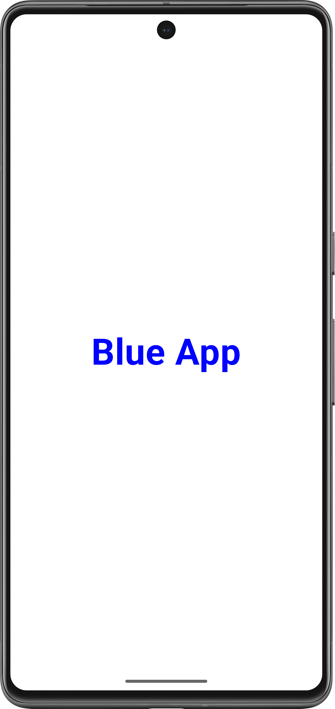
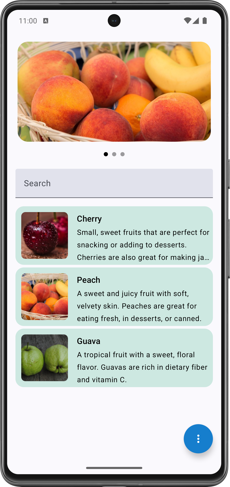
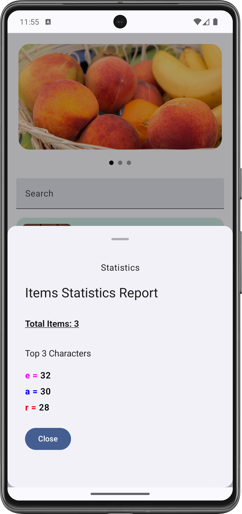
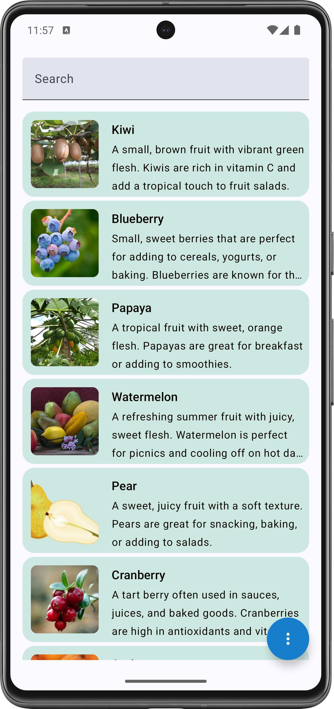
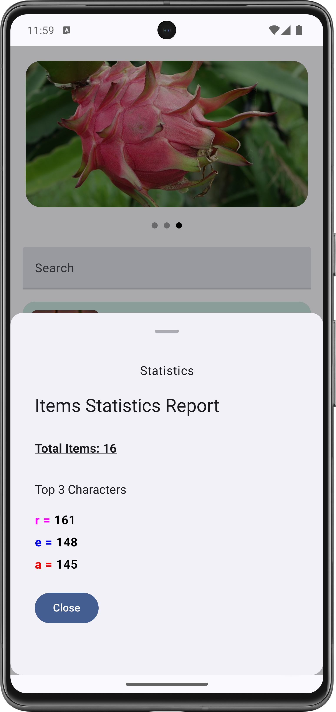
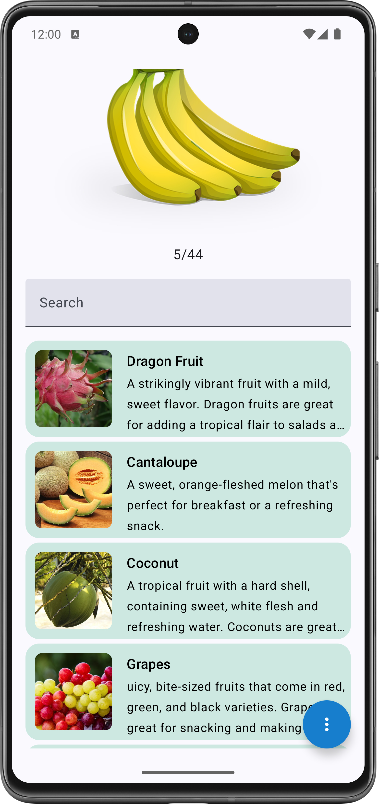
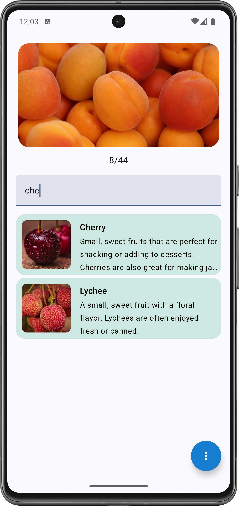
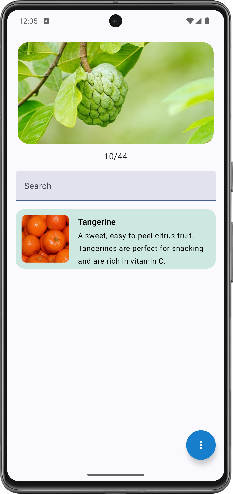
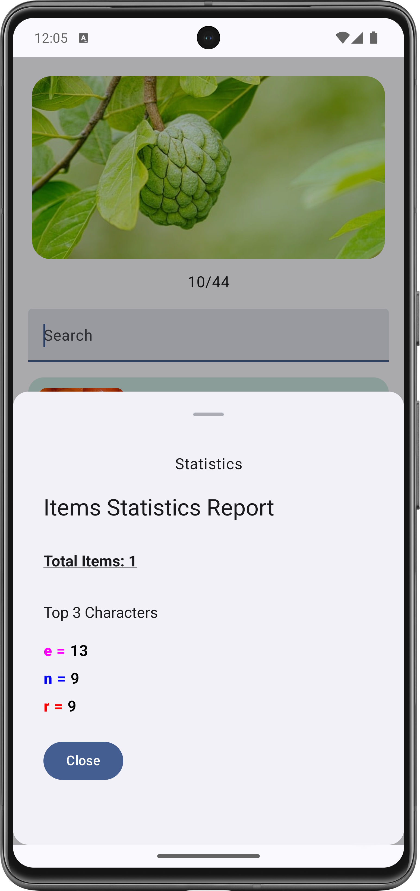

# Jetpack Compose UI Implementation

### This branch contains the Jetpack Compose UI implementation of the project.

- Project theme is based on the Fruits data & images.
- This project has Local Data source for data implementation with latest Android Development tools &
  guideline.
- This project has 2 branches, the one with Compose UI & another branch with XML UI implementation.
- This Task is for a Single Screen with Carousel (Horizontal Swipe) & Item List with Title &
  Subtitle with & image.

**Note:** The Carousel Images & Items in a list can be of any value & dynamic in nature.

## Features

1. Horizontal Image Carousel
2. Search bar - Searchable List
3. Floating Action Button (FAB)
4. Bottom Sheet to display **Statistics**

## Project Architecture & Design Patterns used:

* **MVVM + Clean Architecture Pattern**
* Jetpack Compose & XML for UI
* Dagger Hilt for DI
* Kotlin Coroutines & flow
* Dynamic behaviour & handling as many as Carousel Images & List Items

## Screenshots

Here are the screenshots of the app:

  

  
  
  
  
  
  
  
  

